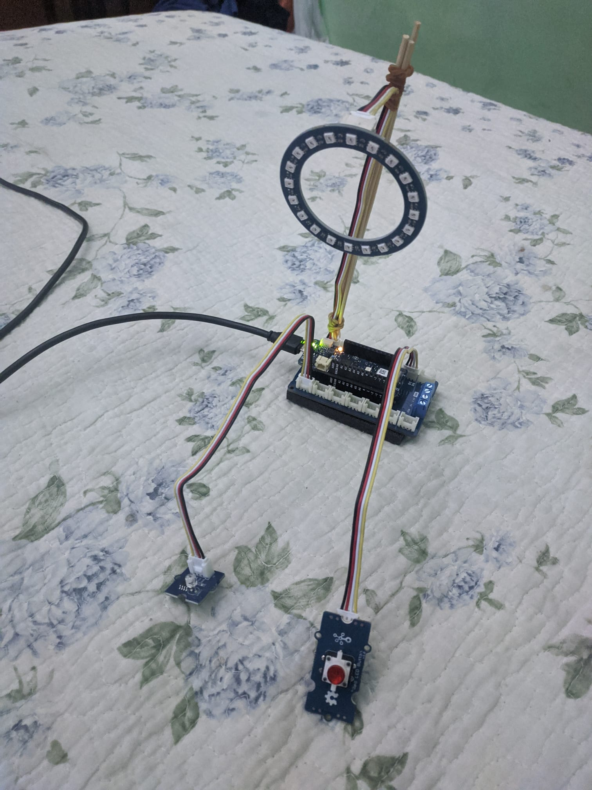

# WeatherLights

## Progetto asincrono Grandis Gianpaolo

Benvenuto nella pagina github del mio progetto, l'idea era principalmente quella di collegare arduino ad un broker MQTT creato su nodeRED. Sfruttando questo collegamento l'intento è quello di inviare una richiesta GET alle API di openweathermap, una volta premuto il pulsante rosso, arduino richidererà il meteo e in base a quest'ultimo il ring RGB otterrà un colore. Infine la luminosità del ring varia in base alla luminosità della stanza grazie al sensore.

Il progetto è composta da:
- **Arduino MKR WiFi 1010**
- **Arduino MKR connector carrier**
- **Grove Light Sensor v1.2**
- **Grove RGB LED Ring (20 Led)**
- **Grove Red LED Button**

Per far funzionare il progetto bisogna inserire un API Key per openWeathermap e inolte nel codice di arduino sono necessari l'ssid della propria rete e la password

 

### Layer Node RED
 

### Immagini 
 
      

